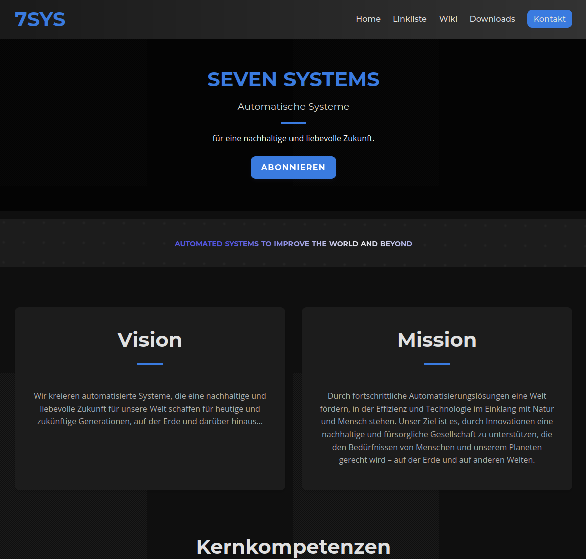
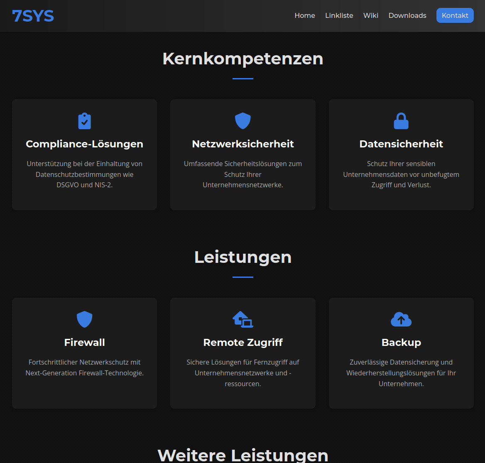
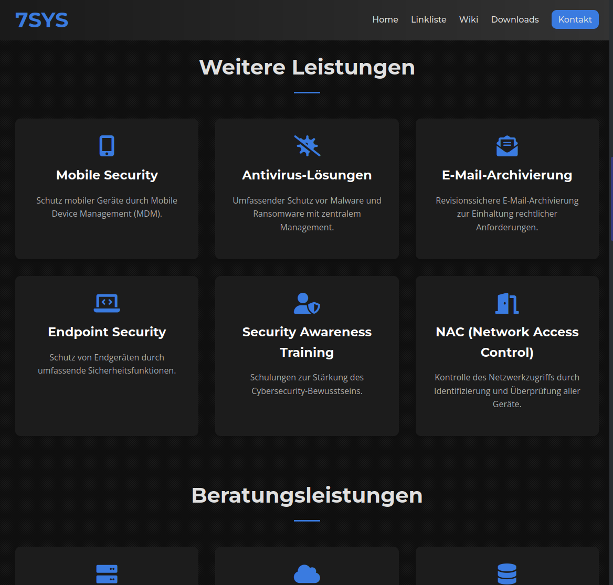
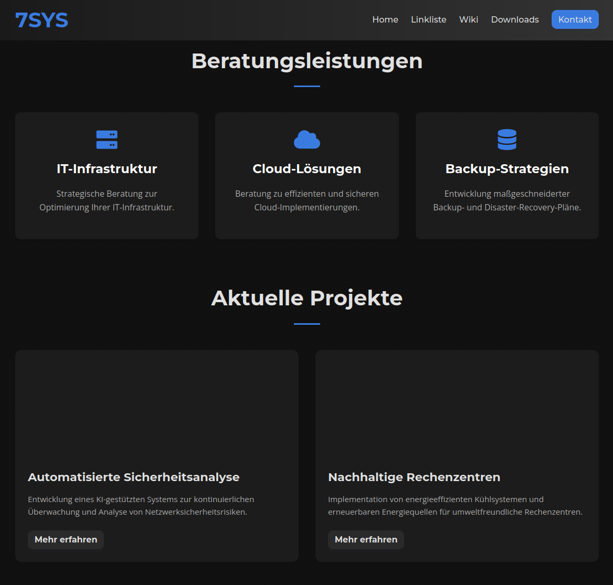
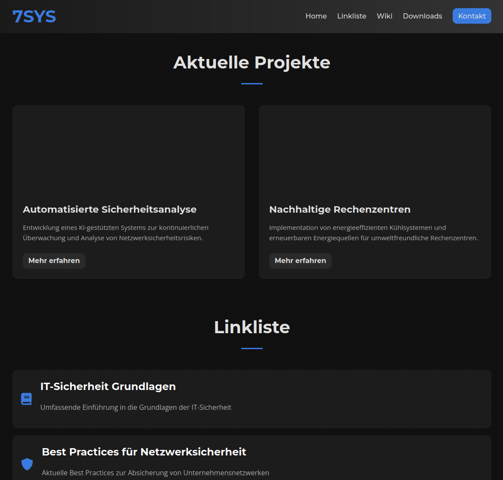
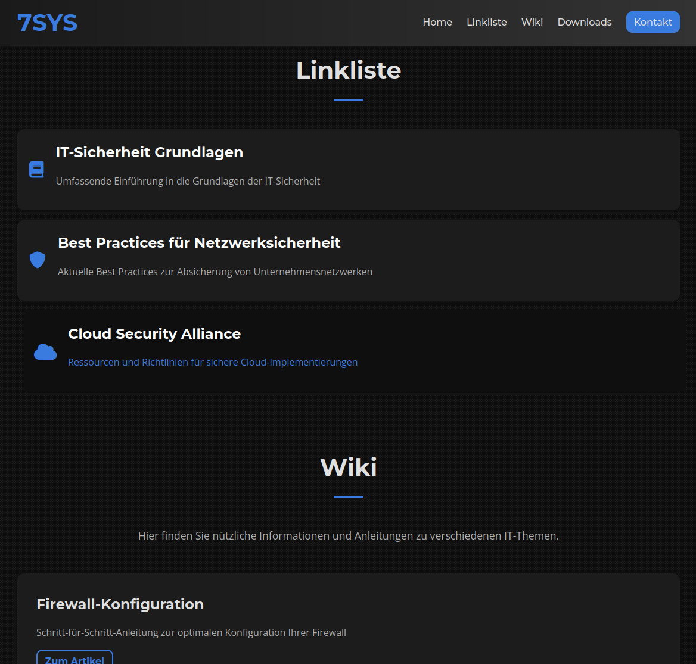
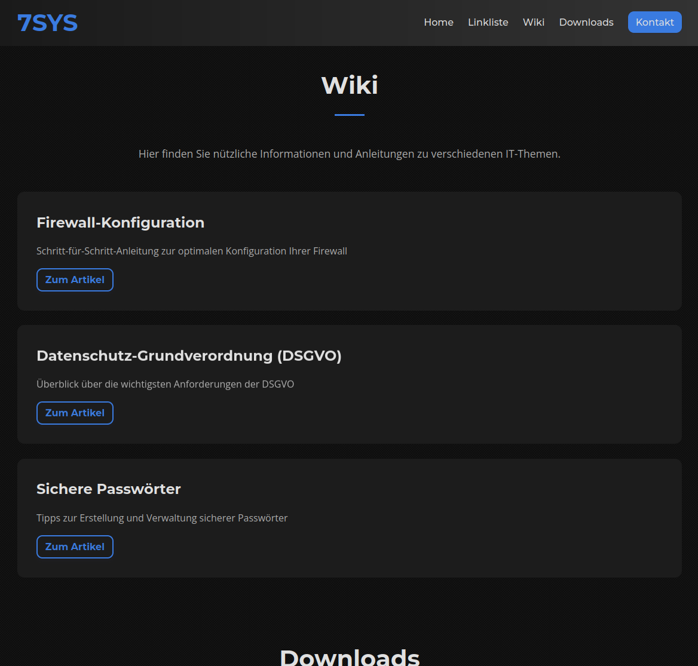
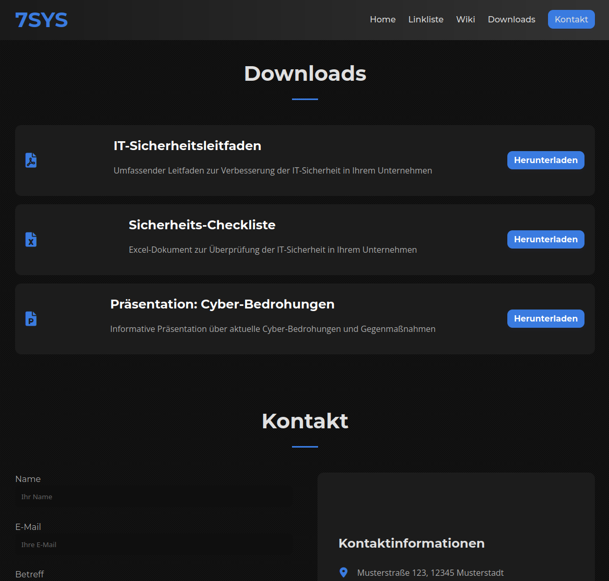
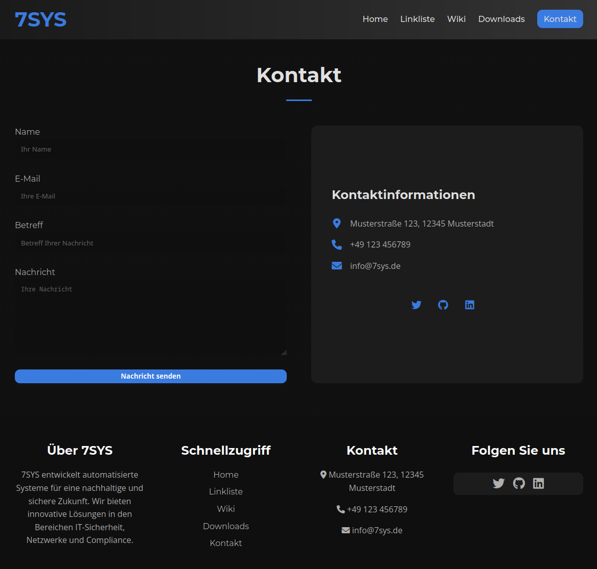

# 7SYS - Automated Systems

Eine moderne Webseite für 7SYS, ein Unternehmen spezialisiert auf IT-Beratung, Netzwerksicherheit, Datensicherheit und automatisierte Systeme.




## Projektübersicht

Diese Webseite dient als Online-Präsenz für 7SYS, ein Unternehmen, das automatisierte Systeme für eine nachhaltige und sichere Zukunft entwickelt. Die Webseite präsentiert die Dienstleistungen, Projekte, Ressourcen und Kontaktinformationen des Unternehmens in einem modernen, responsiven Design.

## Vision & Mission

**Vision:** Wir kreieren automatisierte Systeme, die eine nachhaltige und liebevolle Zukunft für unsere Welt schaffen für heutige und zukünftige Generationen, auf der Erde und darüber hinaus.

**Mission:** Durch fortschrittliche Automatisierungslösungen eine Welt fördern, in der Effizienz und Technologie im Einklang mit Natur und Mensch stehen. Unser Ziel ist es, durch Innovationen eine nachhaltige und fürsorgliche Gesellschaft zu unterstützen, die den Bedürfnissen von Menschen und unserem Planeten gerecht wird – auf der Erde und auf anderen Welten.

## Features

- **Responsive Design**: Optimiert für Desktop, Tablet und Mobile
- **Moderne UI**: Klares, modernes Interface mit ansprechenden Animationen
- **Abschnittsbasierte Struktur**: Übersichtliche Darstellung der Inhalte in thematischen Abschnitten
- **Kontaktformular**: Einfache Kontaktaufnahme über ein integriertes Formular
- **Ressourcen**: Wiki-Bereich und Downloads für nützliche Informationen
- **Projektgalerie**: Showcase für aktuelle Projekte und Referenzen

## Technologien

- **Frontend**:
  - HTML5
  - CSS3 (mit Grid und Flexbox für Layouts)
  - JavaScript (Vanilla JS)
  - Font Awesome (Icons)
  - Lazysizes (für Lazy Loading von Bildern)

- **Backend**:
  - Node.js
  - Express.js
  - Compression (für Performance-Optimierung)

## Installation

1. Repository klonen:
   ```bash
   git clone https://github.com/ben7sys/web7sys1.git
   cd web7sys1
   ```

2. Abhängigkeiten installieren:
   ```bash
   npm install
   ```

3. Server starten:
   ```bash
   npm start
   ```

4. Die Webseite ist nun unter http://localhost:3001 verfügbar.

## Projektstruktur

```
web7sys1/
├── public/                 # Statische Dateien
│   ├── css/                # CSS-Dateien
│   │   ├── base.css        # Grundlegende Stile
│   │   ├── components.css  # Komponenten-Stile
│   │   ├── layout.css      # Layout-Stile
│   │   └── ...             # Weitere CSS-Dateien
│   ├── img/                # Bilder und Grafiken
│   ├── sections/           # HTML-Abschnitte
│   ├── index.html          # Hauptseite
│   ├── impressum.html      # Impressum
│   └── script.js           # JavaScript-Funktionalitäten
├── playground/             # Experimentelle Dateien und Prototypen
├── test/                   # Testdateien
├── server.js               # Express-Server
├── package.json            # Projekt-Konfiguration
└── README.md               # Projektdokumentation
```

## Entwicklung

### CSS-Struktur

Die CSS-Dateien sind modular aufgebaut und in verschiedene Kategorien unterteilt:
- `base.css`: Grundlegende Stile wie Typografie, Farben, etc.
- `layout.css`: Grid- und Flexbox-Layouts
- `components.css`: Wiederverwendbare UI-Komponenten
- Sektionsspezifische CSS-Dateien für jeden Hauptabschnitt der Webseite

### JavaScript-Funktionalitäten

Das `script.js` enthält folgende Funktionalitäten:
- Mobile Menü-Toggle
- Scroll-Effekte für den Header
- Smooth Scrolling für Anker-Links
- "Zurück nach oben"-Button
- Formularvalidierung
- Lazy Loading für Bilder

## Server

Der Express-Server (`server.js`) bietet:
- Statisches Serving der Dateien aus dem `public`-Verzeichnis
- Kompression für verbesserte Performance
- Routing für die Hauptseite und Unterseiten

## Lizenz

ISC Lizenz

## Kontakt

7SYS - Automated Systems
- E-Mail: info@7sys.de
- Website: [www.7sys.de](https://www.7sys.de)










